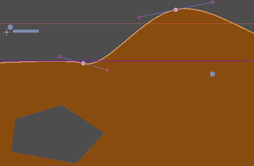
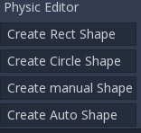
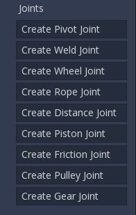
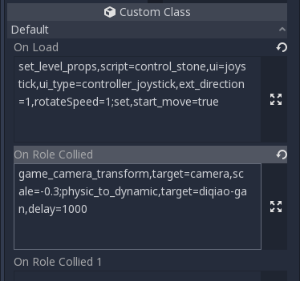

Labo 2D Game Level Editor, An 2D racing and platform game editor for Solar2D

This is a level editor cut from the level editor used inside labo lado team. It is based on GodotEngine and takes a lot of ideas from levelhelper1. it has been used in our commercial products. Due to our limited energy, we only provide sample codes, no documentation. If you want to  use it, you may need to read and extend the codes yourself. if you can master it it will be a powerful editor. We hope that one day, we or others can turn it into a generic 2D Level Editor. In theory, this editor should be cross-platform, but we have only used it on macos now.

## Features:
### 1. Create 2d terrains throught drag-and-drop. 
### 2. Custom terrians textures and edges(tracks).  
 
### 3. Edit physics. Create rectangular, circle or advanced traced shapes, add holes, change material properties and apply collision.  
  

### 4. Create complex physic joints.   

### 5. Insert sub-levels into the main level.
### 6. Scritable.  

 
## How to start
1. Download [GodotEngine](https://godotengine.org/);
2. If you want to dig hode in the terrain, you need to build your own GodotEngine.
3. Download same project.
4. Open Godot, open the project(scr/project.godot).
5. Open level1(src/level1.tscn).
6. Open Corona Simulator to run the project(src/corona/main.lua)
7. Try to edit the level, then click Export Scene button.
8. Enter level 1 in Corona Simulator.

## More
1. scene tree only supports two levels (except the hole).
2. Node name should be unique, If not, it will be auto renamed.
3. group node shoud be a Node2D type.
4. The group with name "road" is special. All the nodes before it, will behind the main role, and all the nodes after it, will  be in front of the main role.
 

## Build Your Own GodotEngine

### 1. Get the Godot Engine Source
First, download the Godot Engine source from [here](https://github.com/godotengine/godot), and switch to branch 3.1+ or 3.2+.

### 2. Drop modules/earcut into modules dir
The earcut module must be compiled with Godot Engine in order to run. Compilation is very easy and simply involves dropping the **modules/earcut** directory into Godot Engine's **modules** directory.

### 3. Build Godot Engine
Please look at the documentation from the official [**Godot Website**](http://docs.godotengine.org/en/latest/reference/_compiling.html) for compilation instructions.

