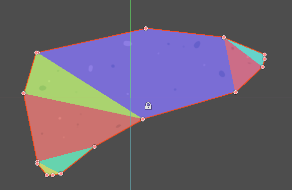

Labo 2D Game Level Editor, a car racing / platform game level editor for Solar2D

This level editor is derived from the internal toolset of Labo Lado team. Built on GodotEngine and inspired by LevelHelper1, it provides essential level editing capabilities. Due to current development constraints, we provide sample code without extensive documentation. Some DIY implementation will be required, but once mastered, it serves as a robust editing solution.
We hope this foundation can eventually evolve into a comprehensive 2D Level Editor. While designed to be cross-platform compatible, current testing has been conducted exclusively on macOS.
 

## Features:
### 1. Create 2d terrains through drag-and-drop. 
### 2. Custom terrians textures and edges(tracks).  
 
### 3. Edit physics. Create rectangular, circle or advanced traced shapes, add holes, change material properties and apply collision.  
  

### 4. Create complex physic joints.   

### 5. Insert sub-levels into the main level.
### 6. Scritable.  

 
## How to start
1. Download [GodotEngine 3.2](https://godotengine.org/);
2. If you want to dig a hole in the terrain, you need to build your own GodotEngine.
3. Download the project's code from Github.
4. Open Godot, open the project(src/project.godot).
5. Open level1(src/levels/level1.tscn).
6. Open Corona Simulator to run the project(src/corona/main.lua)
7. Try to edit the level, then click the Export Scene button.
8. Enter level 1 in Corona Simulator.

## More
1. Scene tree only supports two levels (except the hole).
2. Node name should be unique, If not, it will be auto renamed.
3. Group node should be a Node2D type.
4. The group with the name "road" is special. All the nodes before it, will behind the main role, and all the nodes after it, will be in front of the main role.
 

## Build Your Own GodotEngine

### 1. Get the Godot Engine Source
First, download the Godot Engine source from [here](https://github.com/godotengine/godot), and switch to branch 3.2+.

### 2. Drop modules/earcut into modules dir
The earcut module must be compiled with Godot Engine in order to run. Compilation is very easy and simply involves dropping the **modules/earcut** directory into Godot Engine's **modules** directory.

### 3. Build Godot Engine
Please look at the documentation from the official [**Godot Website**](http://docs.godotengine.org/en/latest/reference/_compiling.html) for compilation instructions.
